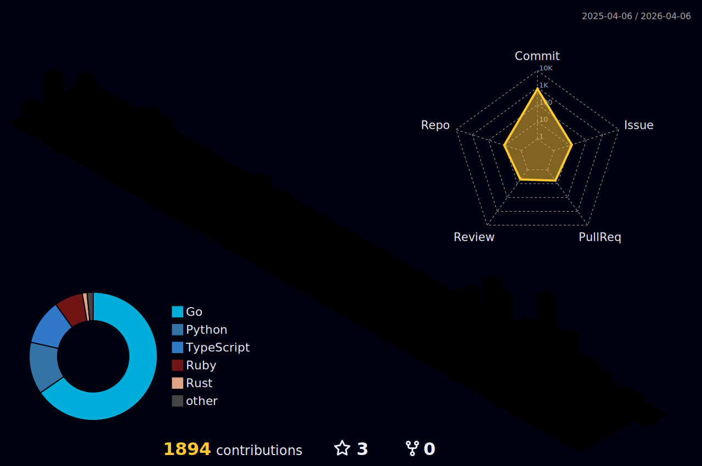

  

  

  
  

  

  ## 🛠️ Tech Stack

**Backend:** Python • Go • Django • FastAPI • Gin  
**Frontend（Learning）:** React • Next.js • TypeScript  
**Cloud & IaC:** AWS • CloudFormation • Docker  
**Databases:** MySQL • PostgreSQL • MongoDB • OpenSearch  
**DevOps:** GitHub Actions • Nginx • CI/CD  
**Other:** Claude • Claude Code • Cursor • Comet • NotebookLM • Gemini

  

  
  
  
  

🔐 Implementing SSO/MFA & SaaS governance at scale  
☁️ AWS Operations & IaC with CloudFormation | Pursuing professional certs  
📝 Active technical writer on Qiita (Python, Go, AWS, Certification Guides)

  ## 📜 Certifications

**AWS:** SCS • SAA • DVA • SOA  
**IPA:** AP • FE • Information Security Management

  ## 📊 GitHub Stats

  

  
  
  

  

  
  

  

  
  

  

  
  
  

  ## 🐍 Contribution Snake

  <picture>
    <source media="(prefers-color-scheme: dark)" srcset="https://raw.githubusercontent.com/sotaheavymetal21/sotaheavymetal21/output/github-snake-dark.svg"
  />
    <source media="(prefers-color-scheme: light)" srcset="https://raw.githubusercontent.com/sotaheavymetal21/sotaheavymetal21/output/github-snake.svg" />
    
  </picture>

  ## 📈 3D Contribution Calendar

  

  
  

## 🏙️ GitHub Skyline

  
  

  

  **🇯🇵 Based in Shiga, Japan | ♨️ Hot spring enthusiast**

  
